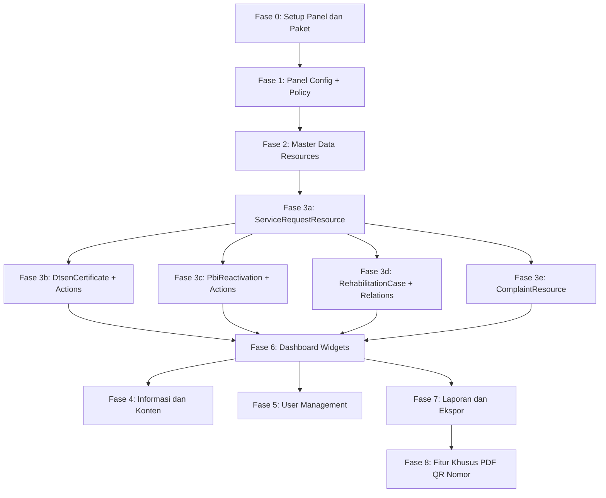

# Rencana Aksi: Dashboard SAPA SOSIAL — Filament v5

> **Stack:** Laravel 13 · Filament ^5.8 · Livewire v4 · PostgreSQL · PHP 8.3+

---

## Status Proyek Saat Ini

| Komponen | Status |
|----------|--------|
| Migrasi database (33 file) | Selesai |
| Model Eloquent (30 model) | Selesai |
| PHP Enum (13 enum) | Selesai |
| Seeder | Selesai |
| Filament Panel | Belum dibuat |
| Filament Resources | Belum dibuat |
| Dashboard Widgets | Belum dibuat |

---

## Fase 0 — Persiapan & Fondasi Panel

> [!IMPORTANT]
> Semua langkah di fase ini **wajib diselesaikan terlebih dahulu** sebelum membuat Resource.

### 0.1 Install Paket Pendukung

```bash
# Hak akses berbasis role
composer require spatie/laravel-permission

# Audit log
composer require spatie/laravel-activitylog

# Generate PDF (surat DTSEN & rekomendasi PBI)
composer require barryvdh/laravel-dompdf

# QR Code untuk kode verifikasi SK DTSEN
composer require simplesoftwareio/simple-qrcode

# Export Excel untuk laporan
composer require maatwebsite/excel
```

> [!WARNING]
> Pastikan setiap paket **kompatibel dengan Filament v5 / Livewire v4** sebelum install.

### 0.2 Inisialisasi Filament Admin Panel

```bash
php artisan filament:install --panels
# Panel ID: admin, path: /admin
```

File yang akan dibuat: `app/Providers/Filament/AdminPanelProvider.php`

### 0.3 Setup spatie/laravel-permission

```bash
php artisan vendor:publish --provider="Spatie\Permission\PermissionServiceProvider"
php artisan migrate
```

**Role yang perlu dibuat (via Seeder):**

| Role | Slug |
|------|------|
| Administrator | `administrator` |
| Petugas Dinsos | `petugas_dinsos` |
| Pejabat Penandatangan | `pejabat_penandatangan` |
| Pimpinan | `pimpinan` |
| Operator Kecamatan/Desa | `operator_wilayah` |
| Masyarakat | `masyarakat` |

### 0.4 Tambahkan Trait ke Model User

```php
// app/Models/User.php
use Spatie\Permission\Traits\HasRoles;

class User extends Authenticatable
{
    use HasRoles; // tambahkan ini
}
```

### 0.5 Buat RoleSeeder & PermissionSeeder

```bash
php artisan make:seeder RolePermissionSeeder
```

### 0.6 Publish Config activitylog

```bash
php artisan vendor:publish --provider="Spatie\Activitylog\ActivitylogServiceProvider" --tag="activitylog-migrations"
php artisan migrate
```

---

## Fase 1 — Struktur Panel Admin Filament

### 1.1 Konfigurasi AdminPanelProvider

File: `app/Providers/Filament/AdminPanelProvider.php`

Hal-hal yang perlu dikonfigurasi:
- **Navigation Groups** sesuai modul layanan
- **Middleware auth** + role check
- **Scope** berdasarkan wilayah untuk Operator Kecamatan/Desa
- **Colors** branding Dinas Sosial (primary: biru pemerintahan)
- **Profile** page
- **Notifications** Filament

```php
->navigationGroups([
    NavigationGroup::make('Master Data'),
    NavigationGroup::make('Layanan 1 — SK DTSEN'),
    NavigationGroup::make('Layanan 2 — Reaktivasi PBI-JK'),
    NavigationGroup::make('Layanan 3 — Rehabilitasi Sosial'),
    NavigationGroup::make('Layanan 4 — Layanan Lainnya'),
    NavigationGroup::make('Layanan 5 — Pengaduan Sosial'),
    NavigationGroup::make('Layanan 6 — Informasi'),
    NavigationGroup::make('Laporan'),
    NavigationGroup::make('Pengaturan Sistem'),
])
```

### 1.2 Buat Policy untuk setiap Model utama

```bash
php artisan make:policy ServiceRequestPolicy --model=ServiceRequest
php artisan make:policy DtsenCertificatePolicy --model=DtsenCertificate
php artisan make:policy PbiReactivationPolicy --model=PbiReactivation
php artisan make:policy RehabilitationCasePolicy --model=RehabilitationCase
php artisan make:policy ComplaintPolicy --model=Complaint
php artisan make:policy UserPolicy --model=User
```

**Aturan Policy:**
- `Pimpinan` — hanya `viewAny` + `view` (read-only)
- `Operator Wilayah` — hanya data di `district_id`/`village_id` miliknya
- Data klien rehabilitasi — hanya officer yang ditugaskan + Admin

---

## Fase 2 — Master Data Resources

> Urutan pembuatan: Master data dulu, karena dipakai Foreign Key oleh resource lain.

| Resource | Artisan Command |
|----------|----------------|
| WorkUnitResource | `php artisan make:filament-resource WorkUnit --generate` |
| DistrictResource | `php artisan make:filament-resource District --generate` |
| VillageResource | `php artisan make:filament-resource Village --generate` |
| ServiceTypeResource | `php artisan make:filament-resource ServiceType --generate` |
| DtsenPurposeResource | `php artisan make:filament-resource DtsenPurpose --generate` |
| ReferralInstitutionResource | `php artisan make:filament-resource ReferralInstitution --generate` |
| ComplaintCategoryResource | `php artisan make:filament-resource ComplaintCategory --generate` |
| ClientCategoryResource | `php artisan make:filament-resource ClientCategory --generate` |

**Catatan `ServiceTypeResource`:** tambahkan Repeater `serviceRequirements` di dalam form untuk mengelola persyaratan dokumen per jenis layanan.

---

## Fase 3 — Resource Layanan Utama

### 3.1 ServiceRequestResource (Layanan 1, 2, 4)

```bash
php artisan make:filament-resource ServiceRequest --generate
```

**Scope query berdasarkan role:**
- Operator Wilayah: `->where('village_id', auth()->user()->village_id)`
- Petugas Dinsos: semua
- Pimpinan: semua (read-only via Policy)

**Kolom tabel utama:**

| Kolom | Tampilan |
|-------|----------|
| `request_number` | Badge link |
| `serviceType.name` | Badge warna per handler |
| `applicant_name` | Text |
| `village.district.name` | Text kecil |
| `status` | Badge warna per enum |
| `is_priority` | Icon flag merah |
| `submitted_at` | Tanggal relatif |
| `officer.name` | Text |

**Custom Actions pada tabel:**
- `VerifyDocumentsAction` — ubah status ke `document_check`
- `RequestRevisionAction` — ubah status ke `revision_requested`
- `AssignOfficerAction` — select officer + ubah status
- `CompleteAction` — wajib isi `service_result` sebelum `completed`

**Form Sections:**
1. Identitas Pemohon (nama, NIK, no. KK, alamat, desa/kecamatan, HP)
2. Detail Layanan (jenis layanan, tanggal pengajuan)
3. Dokumen Persyaratan (repeater upload per `service_requirements`)
4. Catatan Petugas (hasil verifikasi, catatan, assessment notes)

**Tabs di halaman View/Edit:**
- Tab `Detail SK DTSEN` (tampil jika `serviceType.handler === 'dtsen'`)
- Tab `Detail Reaktivasi PBI` (tampil jika `serviceType.handler === 'pbi'`)
- Tab `Riwayat Status`
- Tab `Disposisi`

### 3.2 DtsenCertificate — Relation Manager di ServiceRequestResource

**Custom Actions:**
- `RecordSiksNgCheckAction` — form: is_registered, decile, checked_at
- `GenerateDraftAction` — generate PDF draf dari template
- `RequestApprovalAction` — kirim ke alur persetujuan berjenjang
- `IssueAction` — terbitkan nomor surat + QR code + PDF final
- `RejectAction` — tolak dengan alasan

**Validasi bisnis:**
```php
// SK tidak bisa issued jika decile > dtsen_purpose.max_decile
if ($certificate->decile > $certificate->dtsenPurpose->max_decile) {
    Notification::make()->danger()->title('Desil di luar ketentuan tujuan penggunaan.')->send();
    $this->halt();
}
```

### 3.3 PbiReactivation — Relation Manager di ServiceRequestResource

**Custom Actions:**
- `RecordEligibilityAction` — catat desil + eligibility_notes
- `IssueRecommendationAction` — buat nomor rekomendasi + PDF
- `ProposeToMinistryAction` — catat tanggal input SIKS-NG
- `RecordMinistryDecisionAction` — approved/rejected + tanggal
- `RecordReactivationAction` — catat tanggal aktif di BPJS

Sorting prioritas: `is_priority DESC, submitted_at ASC`

### 3.4 RehabilitationCaseResource (Layanan 3)

```bash
php artisan make:filament-resource RehabilitationCase --generate
```

**Relation Managers:**
- `AssessmentsRelationManager`
- `ReferralsRelationManager`
- `MonitoringRecordsRelationManager`
- `StatusHistoriesRelationManager`

**Custom Actions:**
- `CreateAssessmentAction`
- `CreateReferralAction` (hanya jika `assessment.needs_referral = true`)
- `AddMonitoringRecordAction`
- `CloseCaseAction` (hanya jika `handling_result` terisi)

### 3.5 ComplaintResource (Layanan 5)

```bash
php artisan make:filament-resource Complaint --generate
```

**Actions:**
- `VerifyAction` — status `verification`
- `RequestClarificationAction` — status `clarification_requested`
- `DispatchAction` — pilih officer, status `dispatched`
- `RecordHandlingAction` — isi action_taken, status `in_handling`
- `ResolveAction` — wajib isi `action_taken` sebelum `resolved`
- `MarkDuplicateAction` — pilih complaint induk

**Relation Managers:** `ComplaintAttachmentsRelationManager`

---

## Fase 4 — Resource Informasi & Konten (Layanan 6)

### 4.1 InformationPageResource

```bash
php artisan make:filament-resource InformationPage --generate
```

- Rich text editor untuk `description`, `requirements`, `procedure`
- Status workflow: `draft` -> `published` -> `archived`
- Relation Managers: `DownloadableFormsRelationManager`, `FaqsRelationManager`

---

## Fase 5 — User Management Resource

```bash
php artisan make:filament-resource User --generate
```

- Form: nama, email, password, NIK, HP, work_unit, district/village (opsional), is_active
- Assign roles via Select (spatie/laravel-permission)
- Akses hanya untuk Administrator

---

## Fase 6 — Dashboard & Widgets

> [!IMPORTANT]
> Ini adalah output utama dari permintaan. Semua widget menggunakan **Filament v5 Widgets API**.

### 6.1 Struktur Widgets yang Diperlukan

```
app/Filament/Widgets/
├── DtsenStatsWidget.php              # SK DTSEN — stat cards
├── DtsenIssuedByPurposeWidget.php    # SK DTSEN per tujuan (chart bar)
├── DtsenIssuedByDecileWidget.php     # SK DTSEN per desil (chart pie)
├── DtsenPendingApprovalWidget.php    # Antrean tunggu TTD (table)
├── PbiStatsWidget.php                # Reaktivasi PBI-JK — stat cards
├── PbiByStageWidget.php              # PBI per tahap status (chart bar)
├── PbiOverdueWidget.php              # PBI tertahan > batas hari (table)
├── PbiEmergencyWidget.php            # PBI darurat medis belum selesai (table)
├── RehabStatsWidget.php              # Rehabilitasi sosial aktif (stat card)
├── RehabByStatusWidget.php           # Kasus per status (chart donut)
├── RehabByInstitutionWidget.php      # Rujukan per lembaga (chart bar)
├── ServiceRequestStatsWidget.php     # Total pengajuan masuk (stat cards)
├── ServiceRequestByTypeWidget.php    # Per jenis layanan (chart bar)
├── ComplaintStatsWidget.php          # Pengaduan masuk (stat cards)
├── ComplaintByCategoryWidget.php     # Per kategori (chart pie)
└── WilayahSummaryWidget.php          # Sebaran per kecamatan (table)
```

### 6.2 Widget Cards — SK DTSEN (`DtsenStatsWidget`)

```php
// Filament v5: extends StatsOverviewWidget
protected function getStats(): array
{
    return [
        Stat::make('SK Terbit Bulan Ini',
            DtsenCertificate::whereMonth('issued_at', now()->month)->count())
            ->description('Total surat diterbitkan')
            ->icon(Heroicon::DocumentCheck)
            ->color('success'),

        Stat::make('Menunggu Tanda Tangan',
            ServiceRequest::where('status', 'awaiting_approval')
                ->whereHas('serviceType', fn($q) => $q->where('handler', 'dtsen'))
                ->count())
            ->description('Draf perlu paraf/TTD')
            ->icon(Heroicon::PencilSquare)
            ->color('warning'),

        Stat::make('Ditolak Bulan Ini',
            ServiceRequest::where('status', 'rejected')
                ->whereHas('serviceType', fn($q) => $q->where('handler', 'dtsen'))
                ->whereMonth('updated_at', now()->month)->count())
            ->icon(Heroicon::XCircle)
            ->color('danger'),
    ];
}
```

### 6.3 Widget Cards — Reaktivasi PBI (`PbiStatsWidget`)

Stats yang ditampilkan:
- Total pengajuan PBI aktif (belum completed)
- Menunggu keputusan Kemensos (`proposed_to_ministry`)
- Sudah aktif kembali bulan ini (`reactivated`)
- Pengajuan prioritas darurat medis belum selesai

### 6.4 Widget Table — Antrean Tunggu TTD (`DtsenPendingApprovalWidget`)

```php
// Filament v5: extends TableWidget
protected function getTableQuery(): Builder
{
    return ServiceRequest::with('dtsenCertificate', 'village.district')
        ->where('status', ServiceRequestStatus::AwaitingApproval)
        ->whereHas('serviceType', fn($q) => $q->where('handler', 'dtsen'))
        ->orderBy('submitted_at');
}
```

Kolom: Nomor tiket, Nama pemohon, Tujuan SK, Kecamatan, Tanggal pengajuan, Action (Periksa)

### 6.5 Widget Chart — SK DTSEN per Tujuan (`DtsenIssuedByPurposeWidget`)

```php
// Filament v5: extends ChartWidget, type: bar
protected function getData(): array
{
    $data = DtsenCertificate::join('dtsen_purposes', 'dtsen_purposes.id', '=', 'dtsen_certificates.dtsen_purpose_id')
        ->selectRaw('dtsen_purposes.name, COUNT(*) as total')
        ->whereMonth('issued_at', now()->month)
        ->groupBy('dtsen_purposes.name')
        ->pluck('total', 'name');

    return [
        'datasets' => [['label' => 'Jumlah SK', 'data' => $data->values()->toArray()]],
        'labels' => $data->keys()->toArray(),
    ];
}
```

### 6.6 Widget Table — Sebaran per Kecamatan (`WilayahSummaryWidget`)

```php
// Data agregat per kecamatan:
// Kolom: Kecamatan | SK DTSEN | PBI | Rehsos | Pengaduan | Total
```

### 6.7 Filter Global Dashboard

Setiap widget menerima filter dari `$this->filters`:
- Periode (bulan/tahun atau range tanggal bebas)
- Jenis layanan
- Kecamatan (`district_id`)
- Desa/Kelurahan (`village_id`)

> [!NOTE]
> **Operator Kecamatan/Desa** secara otomatis dibatasi ke wilayahnya — filter kecamatan/desa di-lock ke `auth()->user()->district_id` dan tidak bisa diubah pengguna.

---

## Fase 7 — Laporan & Ekspor

| Laporan | Artisan Command | Ekspor |
|---------|----------------|--------|
| Rekap SK DTSEN | `php artisan make:filament-page DtsenReport` | Excel + PDF |
| Rekap Reaktivasi PBI-JK | `php artisan make:filament-page PbiReport` | Excel + PDF |
| Laporan Rehabilitasi Sosial | `php artisan make:filament-page RehabilitationReport` | Excel + PDF |
| Laporan Pengaduan | `php artisan make:filament-page ComplaintReport` | Excel + PDF |
| Laporan Umum (semua jenis) | `php artisan make:filament-page ServiceReport` | Excel + PDF |

Setiap halaman laporan memiliki: filter periode, filter wilayah, tabel preview, tombol Export Excel, tombol Export PDF.

---

## Fase 8 — Fitur Khusus

### 8.1 Penomoran Otomatis (NumberSequence)

```php
// app/Services/NumberingService.php
public function nextNumber(string $prefix, string $period): string
{
    return DB::transaction(function () use ($prefix, $period) {
        $seq = NumberSequence::where('prefix', $prefix)
            ->where('period', $period)
            ->lockForUpdate()
            ->firstOrCreate(
                ['prefix' => $prefix, 'period' => $period],
                ['last_number' => 0]
            );
        $seq->increment('last_number');
        return sprintf('%s-%s-%05d', $prefix, $period, $seq->last_number);
    });
}
```

### 8.2 Generate PDF SK DTSEN & Surat Rekomendasi PBI

```bash
php artisan make:class Services/PdfGeneratorService
```

- Template Blade: `resources/views/pdf/dtsen_certificate.blade.php`
- Template Blade: `resources/views/pdf/pbi_recommendation.blade.php`
- QR Code embed menggunakan `simplesoftwareio/simple-qrcode`
- Simpan ke disk privat `local`: `certificates/SK-DTSEN-YYYY-NNNNN.pdf`

### 8.3 Alur Persetujuan Berjenjang (`approvals` table)

1. **Paraf Kepala Bidang** — `step=1`, insert record `approvals`, status tetap `awaiting_approval`
2. **Tanda Tangan Kepala Dinas** — `step=2`, update status ke `issued` + generate PDF final

Setiap keputusan tercatat di `approvals` dengan `decided_at` + `notes`.

### 8.4 Riwayat Status Otomatis

```php
// app/Traits/RecordsStatusHistory.php
protected static function bootRecordsStatusHistory(): void
{
    static::updating(function ($model) {
        if ($model->isDirty('status')) {
            StatusHistory::create([
                'statusable_type' => $model::class,
                'statusable_id'   => $model->id,
                'from_status'     => $model->getOriginal('status'),
                'to_status'       => $model->status,
                'user_id'         => auth()->id(),
            ]);
        }
    });
}
```

### 8.5 Notifikasi In-App Filament

Gunakan `Filament\Notifications\Notification` untuk:
- SK baru masuk — notifikasi ke Petugas Dinsos
- SK perlu TTD — notifikasi ke Pejabat Penandatangan
- PBI tertahan melebihi batas hari — notifikasi ke Petugas

---

## Urutan Implementasi yang Disarankan



---

## Catatan Teknis Filament v5

> [!IMPORTANT]
> **Jangan gunakan API Filament v3/v4** — Filament v5 memiliki breaking changes:

| Filament v3 (LAMA) | Filament v5 (BARU) |
|--------------------|-------------------|
| `HasForms` / `InteractsWithForms` | `HasSchemas` / `InteractsWithSchemas` |
| `Form $form` | `Schema $schema` |
| `$form->schema([...])` | `$schema->components([...])` |
| `->icon('heroicon-o-check')` | `->icon(Heroicon::Check)` (enum) |

**Referensi resmi:** https://filamentphp.com/docs/5.x

---

## Estimasi Pekerjaan

| Fase | Scope | Estimasi |
|------|-------|----------|
| Fase 0 | Setup & dependensi | 1–2 jam |
| Fase 1 | Panel config + Policy | 2–3 jam |
| Fase 2 | 8 Master Data Resources | 3–4 jam |
| Fase 3 | 5 Resource Layanan Utama | 8–12 jam |
| Fase 4 | 2 Resource Informasi | 2–3 jam |
| Fase 5 | User Management | 1–2 jam |
| **Fase 6** | **Dashboard Widgets (16 widget)** | **4–6 jam** |
| Fase 7 | Laporan & Ekspor | 4–5 jam |
| Fase 8 | PDF, QR, Nomor Otomatis | 3–4 jam |
| **Total** | | **~28–41 jam** |
